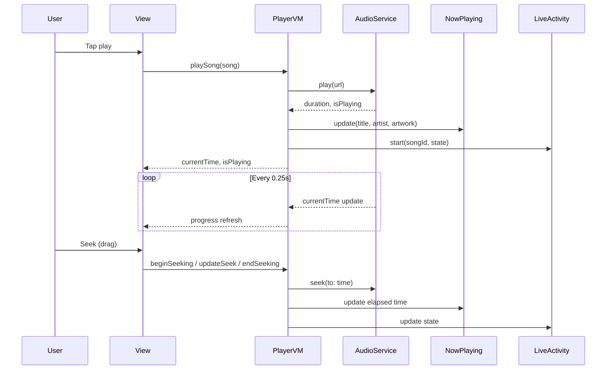
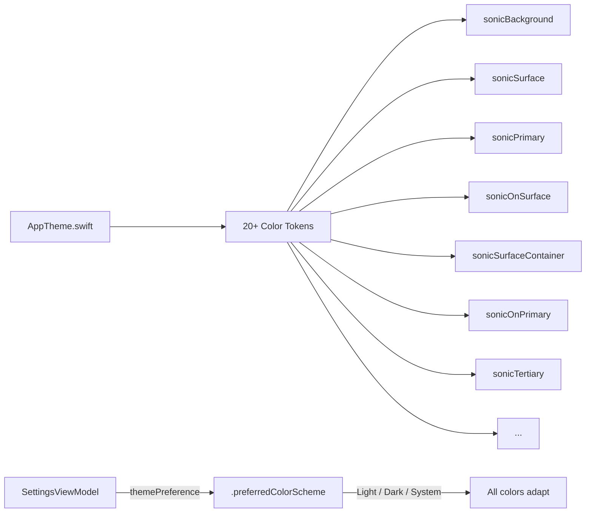
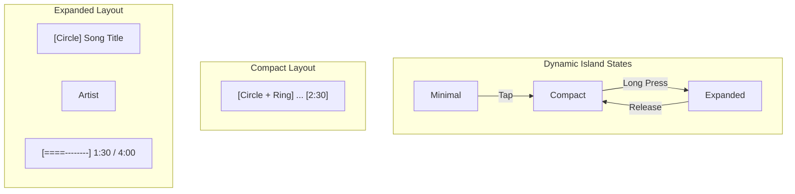

# Mugic

A native iOS and macOS music player built entirely in SwiftUI. Mugic provides a polished listening experience with real audio playback, lock screen controls, Dynamic Island integration, playlist management, and an adaptive dark/light theme system.

The interface was designed in HTML (Stitch prototypes) and then translated into native SwiftUI components. The result is roughly 12,000 lines of Swift across 25 source files, with zero third-party dependencies.

---

## Table of Contents

- [Features](#features)
- [Architecture](#architecture)
- [Project Structure](#project-structure)
- [Screens](#screens)
- [Theme System](#theme-system)
- [Dynamic Island and Lock Screen](#dynamic-island-and-lock-screen)
- [Getting Started](#getting-started)
- [Adding Music](#adding-music)
- [Build Instructions](#build-instructions)
- [Requirements](#requirements)

---

## Features

**Playback**
- Real audio playback via AVAudioPlayer (MP3, WAV, AIFF)
- Interactive seek bar with drag gesture and time display
- Volume control with custom slider
- Shuffle and repeat modes (off, all, one)
- Crossfade toggle (persisted in settings)
- Queue management with reordering, add, and remove
- Simulated progress for sample songs without audio files

**Library**
- Import audio files from the device file system
- Automatic metadata extraction (title, artist, album, artwork) via AVAsset
- Create, rename, and delete playlists
- Add and remove songs from playlists
- Favorites system with persistent storage
- Full-text search across songs, artists, albums, and playlists

**Interface**
- Adaptive light and dark theme with full color system (20+ semantic tokens)
- Smooth animations and transitions on all interactive elements
- Haptic feedback on buttons, tab switches, and playback actions
- Mini player bar with now-playing context
- Full-screen now playing view with album art, controls, and seek bar
- Dynamic greeting on the home screen based on time of day

**System Integration**
- Lock screen and Control Center playback controls via MPRemoteCommandCenter
- Now Playing info with artwork on lock screen via MPNowPlayingInfoCenter
- Dynamic Island Live Activity showing a circular music note with progress ring
- Persisted settings (theme, audio quality, crossfade) via UserDefaults
- Cache size display and clear functionality

---

## Architecture

The app follows the MVVM pattern using Swift's `@Observable` macro (iOS 17+). Three view models are created at the app root and injected into the view hierarchy through SwiftUI's environment system.

```mermaid
graph TD
    A[MugicApp] -->|@State| B[PlayerViewModel]
    A -->|@State| C[LibraryViewModel]
    A -->|@State| D[SettingsViewModel]
    A -->|.environment| E[MainTabView]

    B --> F[AudioPlayerService]
    B --> G[NowPlayingService]
    B --> H[Live Activity]
    B --> I[HapticService]

    C --> J[PersistenceService]
    C --> K[SampleData]

    D --> J

    E --> L[HomeView]
    E --> M[SearchView]
    E --> N[Library Tab]
    E --> O[SettingsView]
    E --> P[NowPlayingView]

    N --> Q[PlaylistView]
    P --> B
```



---

## Project Structure

```
Mugic/
    MugicApp.swift                  App entry point, environment setup
    ContentView.swift               Unused placeholder (kept by Xcode)
    Item.swift                      Unused placeholder (kept by Xcode)

    Models/
        MusicModels.swift           Song, Album, Playlist, Artist, QuickAccessItem
        MusicActivityAttributes.swift  ActivityKit attributes for Dynamic Island

    ViewModels/
        PlayerViewModel.swift       Playback state, queue, seek, volume, media integration
        LibraryViewModel.swift      Playlists, favorites, imported songs, search
        SettingsViewModel.swift     Theme, audio quality, crossfade, cache

    Views/
        MainTabView.swift           Tab bar (Home, Search, Library, Settings) + mini player
        HomeView.swift              Greeting, recent albums, mixes, favorite tracks
        SearchView.swift            Search with tabs (Songs, Artists, Albums, Playlists)
        PlaylistView.swift          Playlist detail with CRUD, shuffle, song picker
        NowPlayingView.swift        Full-screen player with seek, volume, favorites
        QueueView.swift             Queue list with reorder and context menus
        SettingsView.swift          Account, playback, display, cache, about

    Components/
        SharedComponents.swift      SongRow, SongArtwork, MiniPlayerBar, sheets

    Theme/
        AppTheme.swift              Adaptive color system (20+ semantic color tokens)

    Services/
        AudioPlayerService.swift    AVAudioPlayer wrapper with progress timer
        NowPlayingService.swift     MPNowPlayingInfoCenter + MPRemoteCommandCenter
        HapticService.swift         UIImpactFeedbackGenerator wrappers
        PersistenceService.swift    UserDefaults persistence, cache management
        SampleData.swift            22 songs, 5 albums, 4 playlists, 4 artists

MugicLiveActivity/
    MugicLiveActivityBundle.swift           Widget bundle entry point
    MugicLiveActivityLiveActivity.swift     Dynamic Island and lock screen banner UI
    MusicActivityAttributes.swift           Shared ActivityKit attributes
    Info.plist                              Extension configuration
    Assets.xcassets/                         Widget assets
```

---

## Screens

### Home

The home screen shows a dynamic greeting based on the time of day, horizontally scrollable album cards, recommended playlist mixes, and a list of favorited tracks. Tapping an album card starts playback of all its songs.

```
+----------------------------------+
|  Good Evening, Alex              |
|  [Hero Card - Featured Album]    |
|                                  |
|  Recently Played                 |
|  [Album] [Album] [Album] -->    |
|                                  |
|  Recommended Mixes               |
|  [Mix] [Mix] [Mix] -->          |
|                                  |
|  Your Favorites                  |
|  [Song Row]                      |
|  [Song Row]                      |
|  [Song Row]                      |
|                                  |
|  [------- Mini Player --------]  |
|  [Home] [Search] [Lib] [Settings]|
+----------------------------------+
```

### Now Playing

Full-screen view with large album artwork (scales on play/pause), interactive seek bar with drag gesture, volume slider, and action buttons for favorites, add-to-playlist, shuffle, and repeat.

```
+----------------------------------+
|  v  Now Playing                  |
|                                  |
|         +------------+           |
|         |            |           |
|         |  Artwork   |           |
|         |            |           |
|         +------------+           |
|                                  |
|  Song Title                      |
|  Artist Name                     |
|                                  |
|  [====o-----------] 01:23 / 4:12 |
|                                  |
|  [shuf] [prev] [play] [next] [rpt]|
|                                  |
|  [volume slider]                 |
|                                  |
|  [heart]  [add to playlist]     |
+----------------------------------+
```

### Search

Four-tab search with real-time filtering across songs, artists, albums, and playlists. Filter chips for quick category access. Song results include favorite toggle and add-to-playlist buttons.

### Library

Displays all playlists with create and import buttons. The import button opens a file picker for audio files. Each playlist links to a detail view with shuffle play, song management, rename, and delete.

### Playlist Detail

Shows playlist metadata, play and shuffle buttons, a searchable song picker for adding tracks, swipe-to-delete on individual songs, and a toolbar menu for renaming or deleting the playlist.

### Queue

Lists upcoming songs with the currently playing track highlighted. Supports drag-to-reorder and context menus for play-now or remove actions.

### Settings

Persisted controls for crossfade, audio quality (Low / Normal / High / Lossless), theme switching (Light / Dark), cache management with size display and clear button, and an about section.

---

## Theme System

The app uses a custom semantic color system defined in `AppTheme.swift`. Each color adapts automatically between light and dark modes using SwiftUI's `Color(light:dark:)` initializer.



Color tokens follow a naming pattern inspired by Material Design 3:
- `sonicBackground` and `sonicSurface` for layered backgrounds
- `sonicPrimary`, `sonicSecondary`, `sonicTertiary` for accents
- `sonicOnSurface`, `sonicOnPrimary` for text/icons on those surfaces
- `sonicSurfaceContainer`, `sonicSurfaceBright` for card and elevated surfaces

The user can switch between Light and Dark from the Settings screen. The preference is stored in UserDefaults and applied at the app root via `.preferredColorScheme()`.

---

## Dynamic Island and Lock Screen

When a song is playing on iOS, two system integrations activate:

**Lock Screen (MPNowPlayingInfoCenter)**
- Song title, artist, album name
- Duration and elapsed time (enables the system seek bar)
- Embedded artwork extracted from the audio file
- Play, pause, skip, previous, and seek commands all work from the lock screen and Control Center

**Dynamic Island (ActivityKit Live Activity)**
- A circular music note icon with a purple-to-pink gradient ring on its outer edge
- The ring fills proportionally to elapsed time / total duration
- Compact view: circle with progress ring on the left, remaining time on the right
- Expanded view: larger circle, song title and artist, full progress bar with timestamps
- Minimal view: just the progress circle
- Updates on play, pause, skip, seek, and periodically every 10 seconds



---

## Getting Started

1. Clone the repository:
   ```
   git clone git@github.com:utsabfdahal/Mugic.git
   cd Mugic
   ```

2. Open in Xcode:
   ```
   open Mugic.xcodeproj
   ```

3. Select the Mugic scheme and your target device or simulator.

4. Build and run (Cmd+R).

The app ships with 22 sample songs that simulate playback (progress bar advances but no audio plays). To hear real audio, see the next section.

---

## Adding Music

There are two ways to add playable music:

**Option 1: Import at runtime**

The Library tab has an "Import Music" button that opens a file picker. Select MP3, WAV, or AIFF files. The app copies them into its Documents directory and extracts metadata (title, artist, album art) automatically.

**Option 2: Bundle with the app**

1. Drag audio files into the `Mugic/` folder in Xcode.
2. Make sure "Add to target: Mugic" is checked.
3. Update `SampleData.swift` to reference the bundled file:

```swift
Song(
    id: "100",
    title: "My Song",
    artist: "Artist Name",
    album: "Album",
    duration: 210,
    artworkName: "album_cover",
    fileURL: Bundle.main.url(forResource: "my_song", withExtension: "mp3")
)
```

When `fileURL` is set, the app plays real audio and extracts embedded artwork. When it is nil, the app runs in simulation mode.

---

## Build Instructions

The project has two targets:

| Target | Platform | Description |
|--------|----------|-------------|
| Mugic | iOS, macOS, visionOS | Main application |
| MugicLiveActivityExtension | iOS only | Dynamic Island widget |

**Build from command line:**

```bash
# macOS
DEVELOPER_DIR=/Applications/Xcode.app/Contents/Developer \
  xcodebuild -project Mugic.xcodeproj -scheme Mugic \
  -destination 'platform=macOS' build

# iOS (device)
DEVELOPER_DIR=/Applications/Xcode.app/Contents/Developer \
  xcodebuild -project Mugic.xcodeproj -scheme Mugic \
  -destination 'generic/platform=iOS' \
  -allowProvisioningUpdates build
```

**Build from Xcode:**

Select the Mugic scheme, choose your destination, and press Cmd+R. The widget extension is built automatically as a dependency.

---

## Requirements

- Xcode 16.0 or later
- iOS 18.0+ (for Live Activities and @Observable)
- macOS 15.0+ (for macOS target)
- Swift 5.9+
- No third-party dependencies
